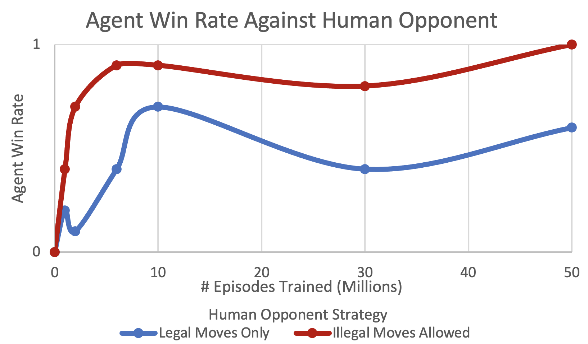

# Final Project Results & Analysis

## Training Specifications
- Learning Rates: 0.1, 0.01, 0.001
- Discount Factor: 0.98
- Epsilon (Rate of exploration): 0.1

I chose to train three agents on different learning rates since I was not sure which would yield the best results. Additionally, with my lack of experience and lack of time, I did not want to add the complexity of hyperparameter optimization.

All 3 agents were trained with a discount factor of 0.98 and an epsilon of 0.1. 

The discount factor was selected using the assumption that it approximately corresponds to a "life expectancy" T = 1/(1-DF), so DF = 1 - 1/T. Since a game of Coup shouldn't go beyond 50 moves, I used T = 50, which yielded DF = 0.98.

Epsilon was set to 0.1 because exploring 10% of the time sounded reasonable. In the future, we could experiment with greater values (0.2 - 0.25). Since the state space is so large, even after 50 million episodes, many state-action pairs were still being "found" for the first time. With a greater exploration rate, we may be able to get a greater coverage of states in less time.

## Testing
All 3 versions of the agent were tested against a human opponent (me) at several points throughout training. It quickly became obvious that two main strategies resulted in very different outcomes against the agent. Either we can choose to only take "legal" actions (those that follow our cards' abilities) or we can allow ourselves to take "illegal" actions. Each version of the agent was tested using both of these strategies individually.

## Results

Note: The 0.001 learning rate yielded test results that mostly seemed random, which indicates that the agent is not learning as fast as the others (due to the small learning rate). The results omit the 0.001 learning rate, and average the other two learning rate test results.

## Analysis
From looking at the data it is clear that the agent has learned to play completely from scratch. In both strategies we see a sharp increase in the agent's win rate in the first 10 million games. For the strategy with only legal moves, we see it level off and wave around 70% wins, and with illegal moves allowed we level off around 95% wins. This wavy behavior is due to the small number of tests and the randomness of the games played.

We can see that when we (the human) take illegal moves the agent has a much higher win rate. This is because the agent learned very well (even early on) when to challenge an opponent's move. We went into this project with the caveat that the agent would have full observation of the state, for simplicity. This means the agent has an advantage over us since it can see both sets of cards. As a result, it was able learn when to challenge because it could learn what legal actions correspond to the cards in the opponent's hand. 

In the strategy with legal moves only, it levels off but with a greater variance. Since we are restricted to only legal moves, the winner of the game comes down to the slight benefit they get from the cards they have. In other words, in this case the winner of the game is almost always the one with the slightly better cards, regardless of the skill of the players.

Some information is not visible in the data. For instance, even at 50 million episodes there were states for which I could take an "illegal" action and not get challenged by the agent. This shows that there were still some holes in the random coverage of states through training. It would take a lot more training to hit all possible states through random exploration, especially those very unlikely states. The lack of complete coverage is backed up by analyzing the Q-tables of episodes 49 million and 50 million. In 1 million episodes, we are still setting 9000+ Q-values to non-zero values for the first time. This means that knowledge from future states has just now "trickled back" to those states. If there are so many Q-values that are still set to 0, then there is clearly a lot more training necessary for full convergence.

Another behavior of the agent I noticed occurred in some of the less likely states, like when I had two of the same card. In these states, the agent would often take a strange or even bad move. It seemed as if it didn't know what to do, because it hadn't had enough experience in these states yet. This makes sense since these states are less likely to be encountered in training, so the Q-values have not been updated enough for it to know which actions are good.

## Successes
This was my first project with RL, I built everything from scratch, and I learned a lot. Everything functions properly, and the agent did learn, though not to the extent I had hoped for this amount of training. However, with what I learned, I know the solutions that are more fit for this problem (POMDP, Deep RL).

Since the agent had full view of both players' cards, it was able to learn which moves are legal and when it should challenge an opponent's illegal move. Though this is a result of the caveat we accepted to simplify the project, it is still a success since learning is taking place.

Even when a player played without lying, we can see some improvement in the agent's skill. This corresponds to the agent learning to prioritize certain moves and strategies over others; it learned which moves are more likely to result in an overall win. This is the entire idea of RL: over many games the rewards will "trickle back" and the agent will be able to "see into the future" and pick actions that are best in the long term.

## Potential Improvements
In order to make the game 100% accurate to real play, we would need to prevent the agent from seeing the opponent's cards. This would result in a Partially Observable MDP (POMDP). This adds a fair amount of complexity, but the agent would finally be able to learn to lie. In the current implementation, the agent never learned to lie. It learned from experience that the other agent would always challenge whenever it makes an illegal move. By preventing the full observation, we would have much more interesting analysis to do with the agent's strategies.

Next, since the main issue is the large state space, this problem could benefit from Deep RL, which uses a neural network instead of an explicit value function (Q-table). This would likely allow convergence in a much shorter time.

Also, we could use hyperparameter optimization. Adjusting the learning rate throughout training could result in faster convergence.

Finally, it may be possible to speed up training by using a GPU. Since an individual game would not benefit from being parallelized, training could benefit from running one game per GPU thread.

## Other Limitations and Considerations
States that are very similar to each other don't benefit from knowledge learned from other similar states. For example, two states that share everything except P1 having 1 coin or 0 coins. One state would not benefit from the learning of the other state. In reality a player would have practically the same strategy in both. While the agent would learn both strategies through training, and they may end up the same, if there was some way to share this knowledge overall training time could be reduced. This is a general limitation of traditional RL.

A human element of the game is that with more people playing, you can see how an opponent reacts and interacts with other players' moves. This allows you to collect more data about what cards they may have, without you actually being at risk. As a result, you are more informed when challenging them. Since we limit the complexity by having only 2 players, this is not possible here.
